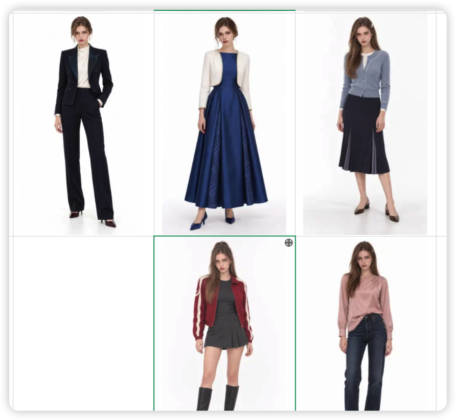
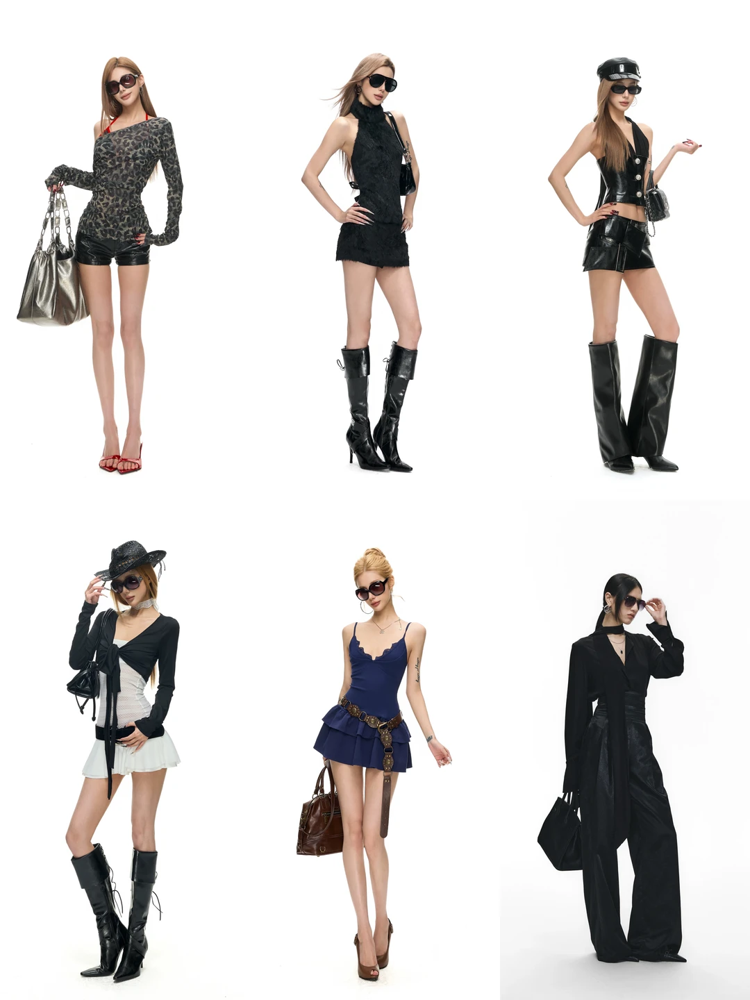

# 用户十九图参考｜女装大胆搭配与角色比例转译

来源：用户于 2026-09-23 上传的 19 张图片，按消息顺序保存于同目录 `原图/01.png`—`19.png`。01 是上一轮五套女主提示词的实际成图拼图；用户总体觉得不错，但指出**仍偏稳重、不够敢设计**。02 是用户指定的**常规纤细角色身材方向参考**，但用户明确要求剧本中的胖女孩或其他特殊体型仍服从人物设定。03—19 是服装设计参考。图片中的商标、文字、人物面孔、纹身、包、墨镜、手持物、场景和现成整套造型均不继承为项目资产。

本页记录用户审美偏好与视觉机制，不把画册或影视截图说成某个国家的真实着装统计；具体角色仍需按城市、季节、收入、职业、场合和动作校准。图 09—13 多为半身或局部取景，不能作为头身比证据。图 02 的身材可能同时受鞋跟、姿态、摄影与图像修饰影响，不能把照片像素比例机械复制给所有角色。

## 一、上一轮五套为何显得稳重（图 01）

上一轮完成了颜色、面料、妆发和真实穿着关系，但五套中的三套落回熟悉的安全组合：深蓝西装＋白衬衫、短开衫＋中长裙、粉衬衫＋牛仔裤。蓝裙礼服有体量，红色运动夹克有年轻感，仍缺一个从中景就能看见的结构或搭配冲突。提示词频繁使用 `subtle`、`restrained`、`narrow`、`barely visible`、`low-contrast`、`small` 一类词，把图案、滚边和贴饰压到缩略图中不可见。**这是真实成图与用户文字反馈支持的诊断**；它不等于用户否定五套的全部方向，也不等于所有角色都该穿高强度造型。

修正方法：先确定一个可读的**服装关系**，例如“浪漫花纹上衣＋粗粝工装长裤”；再给上身中景一个明显的颜色、层次或裁片焦点；下身与鞋提供第二处回响。一个主轴可以组织两三处看得见的设计，不是只许一个微小装饰。

## 二、图 02 的身体方向：纤细，但不是模板化瘦身

- **视觉特征：**头部相对全身偏小，肩颈舒展，胸廓与骨盆轻窄，腰自然有形但不夸张，臀部后侧体量克制；腿从胯、膝到踝连贯修长。短上装、高腰短下装、长裤落鞋和高筒靴放大了这种视觉比例。
- **不可机械复制：**不能从单张画册推断真实身高、精确头身数字或腿长百分比，更不能用细腰、大胸、大臀的反向夸张来“性感化”。高跟鞋、站姿和镜头也参与了效果。
- **项目默认转译：**当剧本没有特殊体型时，继续采用项目的约 8.5—9 头身、高挑轻窄成年人方向；提示词同时明确肩、腰、胯、膝、踝连接和衣物长度，不靠一句“九头身”。若剧本写胖女孩、孕期、强壮、年长或其他体型，则以剧本为先，保持该体型内部的自然比例与美感，而非强行瘦成图 02。
- **参考分工：**用户给的人脸图负责身份；图 02 只提供身体与服装比例的审美方向，不继承其面孔、发色、妆容、衣服、鞋、道具或特定姿势。多人物拼图不宜直接当作唯一“换身”图使用，以免模型混入不相关角色和服饰。

## 三、逐组拆解：学搭配关系，不复刻整套

| 图片 | 观察到的服装组织 | 可转译的设计动作 |
| --- | --- | --- |
| [03](原图/03.png) | 奶油色结构短裙、白色软垂长裙、蓝色层叠短裙呈现同一身材上的三种长度和材质；腰部结构在蓝裙上很醒目 | 用宽腰片连接上衣与两层短裙，或在正式裙装中让柔软裙身从真实腰缝放量；改用原创裁片，不复刻露胸杯型 |
| [04](原图/04.png) | 白色上身分别与粉色阔裤、钴蓝窄裙和白色蕾丝长裤相连；上紧下阔、冷暖色和实虚材质不断换位 | 一件高覆盖白上衣能靠下装体积与材质变得大胆；蕾丝长裤要有场合合适的实色内层，胸部不透视 |
| [05](原图/05.png) | 冰蓝短裙、浅黄上衣与深棕裙、绿上衣与丹宁短裤；甜色由深色或丹宁压住 | 亮色负责第一眼，深色下装负责稳住；下摆细边、腰部五金或鞋色作第二节奏，不复制露内衣结构 |
| [06](原图/06.png) | 白色高领与灰阔裤、白色短袖与棕色紧裤、白色垂褶上衣与短裙，靠同色上衣换下装骨架 | 同一角色的衣橱可复穿白上衣，通过裤长、裙长和面料硬度改变气质；腰线与鞋必须接住轮廓 |
| [07](原图/07.png) | 挂脖长裙形成肩到摆的连续垂线；半透明外层与浅灰宽裤形成轻重差 | 连续长线可大胆露肩／背，同时完整覆盖胸部；薄层需真实固定点、离体空间和受力垂落 |
| [08](原图/08.png) | 黑色软垂上衣分别接宽裤与白短裙；白色纵排扣上衣接白长裤 | 主上衣可被下装轮廓重新定义；同色穿搭靠门襟、织纹、宽窄和鞋型，不能只写“高级黑白” |
| [09](原图/09.png) | 酒红绒感外层、同色微光内搭与深色牛仔；精致上身与普通下身同框 | 正式度错位让人物有自己的穿法；外层袖肘和牛仔腰部要有穿着压痕 |
| [10](原图/10.png) | 暗色开衫、贴身上衣、金色纹样短裙和点纹薄袜，纹理从腰往腿部接续 | 让裙纹与袜纹有疏密递进；图案不必铺满上身，保留呼吸色面 |
| [11](原图/11.png) | 深棕修身层搭与暗纹短裙，头部针织和多层细链产生个人习惯感 | 人物辨识可来自重复的穿着习惯和旧物感；角色板只保留规则允许的首饰／发饰 |
| [12](原图/12.png) | 深梅色短上衣、分离式袖和长图案裙形成皮肤断层与材料反差 | 可提炼“短上＋长下”和独立袖型，但按剧本和胸部覆盖规则处理露肤，不照搬具体造型 |
| [13](原图/13.png) | 细纹高领内层与棕色吊带式短裙叠穿；纽扣和尖角腰线构成中景焦点 | 使用紧密内层＋结构外裙，外层应有真实肩带、腰部压痕和明确闭合方式 |
| [14](原图/14.png) | 红绿抽象印花贯穿上身和不规则裙摆，斜向荷叶边配厚重黑靴 | 主纹样有路径和方向；甜裙的飘量由厚底鞋压住；需重新设计原创纹样且胸衣完整覆盖 |
| [15](原图/15.png) | 宽松图形 T 与短丹宁，或简洁上衣与多层粉色蕾丝不规则裙 | 上简下繁、旧感棉布与精细网纱碰撞；图形必须原创无字，内层不做外露内衣 |
| [16](原图/16.png) | 花纹短上衣与非常宽的深色牛仔，腰侧小红点在鞋端重复 | 柔花纹集中上身，下身大面积深色；一个小色点重复两次让搭配完整 |
| [17](原图/17.png) | 小花上衣、白色毛边短裤与西部靴；轻软上身与粗犷鞋履对打 | 以不同类别的衣服形成年轻感；毛边、绣纹和靴筒各有作用，不必满身贴饰 |
| [18](原图/18.png) | 白色立体花上衣与黑色宽丹宁，局部红色让视线停留 | 一两处立体贴花与粗斜纹裤构成软硬冲突；贴花必须缝在衣片上并有真实阴影 |
| [19](原图/19.png) | 粉蓝抽褶短上衣、芥末黄大口袋宽裤，腰间白色蕾丝罩片过渡 | 大胆配色加大面积安静色面；腰部罩片需明确缝点、厚度和重力，不能像后期贴图 |

## 四、以后设计女装时改变什么

1. **先设强度，再定搭配。**普通剧情日常、角色主动经营形象、年轻私服、晚宴／秀场化时刻的服装强度不同。用户要求大胆或提供高强度参考时，不能自动退回“针织衫＋半裙”“衬衫＋牛仔裤”“深色西装＋小滚边”。若场合只能日常，仍可通过颜色、类别冲突和穿法显出性格。
2. **主轴是关系，不是小配件。**优先从“甜美花纹＋粗硬工装”“轻纱＋厚牛仔”“窄上身＋宽长裤”“松上衣＋短裙长靴”“光泽上身＋哑光下装”选一个；再给它两处可读的执行点，例如有方向的图案和与之呼应的鞋色／腰部结构。一个主轴允许多处设计同时出现，只要主次清楚。
3. **禁止把全部设计词压成低存在感。**如果核心亮点全部被写成 `subtle / narrow / tiny / barely visible / low contrast / restrained`，缩小到竖屏中景后就退化为普通单品。为主焦点规定可见面积、位置与轮廓；只有辅助节奏和近看工艺才保持低对比。
4. **让“甜”有反方向。**甜美不等于全身粉、花朵、蓬袖和浅色；可以让柔软印花或蕾丝遇到硬丹宁、工装袋、皮靴、粗鞋底或深色大裤量。反方向必须符合人物身份、收入与动作。
5. **图案跟着裁片走。**原创图案、贴布、荷叶边、薄纱罩层都要有缝点、边缘厚度、遮挡关系和受力方向。静态站立与自然动作中允许皱褶、遮挡与图案透视变形；不要把它当平面贴纸。
6. **衣长、裤脚和鞋共同定比例。**短外层停在高胯，高腰线真实落在腰部；宽裤垂至鞋面，短裙与靴筒之间留有意的腿部段落。腿长来自服装分段与正确机位，不靠瘦腿滤镜或失真的超小头。
7. **用中景做淘汰测试。**把设计想象缩到胸腰以上：领口、肩线、外层长度、上身色块和一个图案／贴饰是否仍可辨？若只剩纯色常规上衣，须改上身设计或层搭，而不是继续装饰裙摆。
8. **角色身份始终比画册重要。**图 02 的纤细比例是默认偏好而非全部角色的统一体型。图 09—13 的“穿过一天”的细小松量可补白底样片的广告感；图 14—19 的强设计只在人物性格和场合支持时转译。角色脸只来自用户确认的脸模，发型和妆容可随衣服变，不能照搬参考人物。

## 五、下一轮提示词与成图检查

写提示词前用一句话确定：`她在什么场合，哪两类衣服发生碰撞，第一眼可见的焦点在身体哪一段？` 然后按 **轮廓 → 可见对比 → 材质重量 → 图案／裁片落点 → 妆发鞋履 → 真实受力** 写。9:16 单人全身先看头身、肩腰胯膝、衣服的悬垂与贴合，以及小图观看时是否抓眼；认可后才做 16:9 三视图。用户反馈要分别记录“服装审美认可”“人体比例认可”“已生成图片”和“已锁定资产”，不能互相代替。
