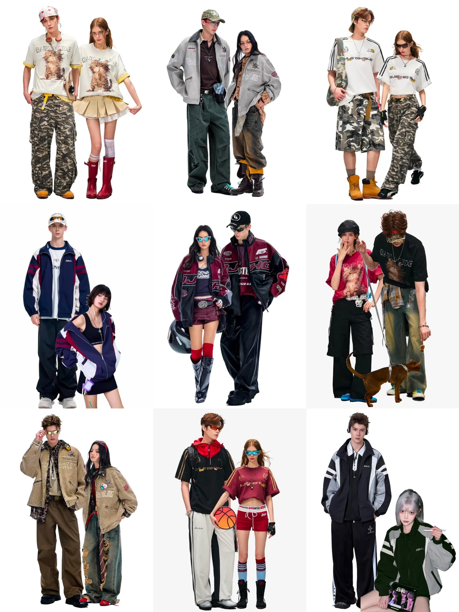

# 用户参考图学习｜年轻街头、暗色浪漫与松弛男装

来源：用户于 2026-09-23 提供的 15 张图片；原图按用户消息顺序保存在同目录 `原图/01.png` 至 `原图/15.png`。本文件只提炼**服装搭配**，包括服装本身、鞋履以及与衣服直接相连的结构。参考图中的手持物、包、宠物、背景、模特面貌、现成文字、商标和可识别图案均不是设计输入。

**证据边界：**这些图片说明用户喜欢的风格，不等于美国某城市、阶层或职业的真实着装样本。图 01 偏年轻街头造型拼贴；图 02—06 是强度更高的秀场女装；图 07—15 是同一气质的男装画册。不能把十五张混成一种“欧美风”，也不能因为用户说“美式”就把画册来源、流行程度或真实穿着场合当作已核实事实。应用到海外短剧仍要先核对剧本地区、季节、身份、收入、场合和动作。

## 一、从图里学到的搭配关系

### 图 01｜年轻街头拼贴

- **轮廓：**女装多用宽 T／运动外套配短裙或短裤；男装多用箱型短外套、图形上衣配宽松工装裤。短上装和长宽裤、宽上装和露腿短下装互相切换，故意不让上下身平均宽松。
- **层次：**球衣、工装、运动夹克、牛仔、迷彩或原创抽象印花混搭；外层的颜色和长度与内搭形成两级边界。
- **色彩与鞋：**灰、黑、军绿、海军蓝、卡其打底，以红、黄、酒红或钴蓝作小面积跳色；靴筒、袜口和鞋的体量接住裤脚或裸露腿部。
- **可迁移：**年轻感靠服装类别之间的碰撞、宽窄比例和鞋服呼应，不靠“年轻女孩＝粉色花裙”。可做原创无字图形、局部旧化或色块，但不能复制现成衣服文字、商标、队徽或成套情侣装。

### 图 02—06｜暗色浪漫秀场女装

| 图 | 服装观察 | 可以提炼 | 要收敛的地方 |
| --- | --- | --- | --- |
| [02](原图/02.png) | 海军蓝蓬袖上衣＋黑丝绒高腰短裤；胸前交叉线、宽腰线、网纹袜形成连续的黑色线条 | 上松下短；深蓝与黑的材质差；系带可改成**覆在完整不透视内层上的装饰结构** | 敞开胸口、密集绑带与网袜同时使用，容易过度秀场化 |
| [03](原图/03.png) | 白色短上衣＋局部黑蕾丝＋黑色 A 字短裙，袖量与裙摆量呼应 | 黑白大色块、局部蕾丝、短上衣与高腰裙明确分段 | 原图深开口和袜鞋组合不能直接复制到日常造型 |
| [04](原图/04.png) | 黑色窄主体、点纹轻薄袖、少量皮革肩腰与短裤 | 同黑色用哑光、半透外层、微光皮革区分；轻上身配短下装 | 大腰封、飘丝、网袜不宜全数叠加；胸部保持完整不透视 |
| [05](原图/05.png) | 黑色纹理上身＋高腰腰带＋丝绒鱼尾长裙 | 上轻下重；从膝部才放量的长线条；蕾丝与丝绒对比 | 上身透视须加入完整内衬；鱼尾宽度要允许剧情动作 |
| [06](原图/06.png) | 黑底不规则金色纹理长裙，肩部略亮，纵线不断 | 一条连续裙身＋有方向的金色纹理，正式场合中景抓眼 | 不照搬满身金属反光或高开口，避免像硬质金属或压过人脸 |

**用途区别：**图 01 提供日常／街头的“服装组合语法”；图 02—06 提供夜间、社交和正式场合的材质、量感、线条语法。秀场图每次最多提取一项主机制，再按角色的真实场合降强度；不把整套直接当成北美日常服装。

### 图 07—15｜松弛且有结构的男装画册

| 图 | 只看服装的观察 | 可复用机制 |
| --- | --- | --- |
| [07](原图/07.png) | 棕色箱型短衬衫、白衬衫领与反折白袖口、深灰宽牛仔 | 深外层与浅内层在领、袖、下摆三处呼应；短上长下 |
| [08](原图/08.png) | 米白短立领上衣、灰褐高腰宽裤，领口小扣和斜向裤腰裁片 | 浅上深下；领部闭合与腰部斜线是两个克制但可见的设计点 |
| [09](原图/09.png) | 深蓝短上衣露出白色内领和袖口，下接黑色细条纹宽裤 | 一种主色＋两处浅色边界，裤纹负责纵向拉长 |
| [10](原图/10.png) | 深棕短夹克，较高领口、清楚门襟与小金属闭合，下接宽裤 | 夹克停在高胯，外层结构和全长裤共同解决身材比例 |
| [11](原图/11.png) | 黑棕拼接短皮夹克，宽驳领，下配暗色宽牛仔 | 以领片色块和皮革重量做焦点，不靠传统西装领带 |
| [12](原图/12.png) | 深蓝短外套与同色内层叠穿、炭灰细条纹宽裤 | 近色层搭，通过不同厚度和领高显示层次 |
| [13](原图/13.png) | 橄榄绿短衬衫、浅米色翻领和卷起的袖口、黑宽裤 | 领袖两处浅色露边可让朴素单品被看见 |
| [14](原图/14.png) | 浅石色短夹克、简洁闭合结构、深棕宽裤 | 与图 10 同一种结构换明度后，人物气质明显变轻 |
| [15](原图/15.png) | 灰色细纹针织叠白衬衫领和窄领带，下配黑宽裤 | 柔软学院感来自细纹与领口层次；整体仍靠宽裤和鞋托住 |

男装共同点是**短上身、相对高的裤腰、真正到鞋面的裤长、适度宽的裤管**。领、袖口或内层只露出一小段，不必每套同时有大翻领、领带、饰扣和腰部挂件。鞋型要承接裤脚体量，不能让裤管悬在小鞋之上。这是画册中的设计机制，不证明某个美国城市的人普遍这样穿。

## 二、以后设计时的执行方法

1. **先锁角色现实条件，再选风格强度。**写清城市、季节、职业／社交身份、收入、出行方式、场合与动作。图 01 的街头语言适合年轻私人生活或娱乐场合；图 02—06 的语言仅在社交、夜间或正式场合有合适位置；图 07—15 的男装语言可转译为年轻创意工作或非正式出行，不能自动代替所有职业装。
2. **先用服装画轮廓，不先加装饰。**在脑中先选“宽上＋短下”“短上＋宽长下”“轻上＋重下”或“窄长主体＋局部放量”之一，再核对肩、腰、胯、腿和鞋是否顺畅。女装不必总是收腰 A 字中裙，男装不必总是标准西装。
3. **给腰线与鞋各一项工作。**腰线负责辨认上短下长或上松下窄，鞋与裤脚／裙摆负责延续纵线或形成有意的重量平衡。过长外套、过低裤裆、裤口离鞋太远、靴筒截断裸露腿部，都会让人物显矮。单写“九头身”不够。
4. **用两种不同性质的面料，而不是两种形容词。**例如挺括牛仔＋软针织、运动面料＋压褶裙、皮革边片＋哑光布、蕾丝表层＋不透明里层、短夹克＋垂坠全长裤。写清固定点、厚度、遮挡、接触阴影和自然受力褶，避免像贴图。
5. **把图案当成路径和面积。**图案可沿门襟、袖、前片或裤侧分布，保留安静色面；小图案只负责近看，手机中景至少有一个能读到的大色块或轮廓关系。使用原创无字图形、抽象纹样或普通材质纹理，不复制参考图的字、队徽和品牌标识。
6. **一个主轴加两次呼应。**主轴可以是宽窄比例、深浅配色、领袖两处浅色露边或有方向的纹样；另两处弱呼应落在袖口、腰线、鞋或材质上。不要把每个部位都做成主角。
7. **最后做人物与镜头测试。**脸模只锁身份，服装试验先用 9:16 单人全身检查比例、真实穿着和鞋底完整入镜；正式三视图按项目规则另做 16:9。胸部必须有完整不透视覆盖。进入竖屏中景后，上身焦点仍需可读。

## 三、两个搭配示范（方法示例，不是当前剧目新增造型）

- **年轻女性的现代甜酷：**箱型海军蓝运动外层＋完整覆盖的短针织内搭＋高腰深色短压褶裙；上身宽、腰线清楚、腿部留长；少量酒红原创图形与鞋口呼应。重点是比例和运动／裙装碰撞，不依靠碎花、蓬袖和淡粉把人做成乡村甜妹。
- **年轻男性的松弛设计感：**高胯长度的棕色短夹克＋浅色内领／反折袖口＋深灰高腰全长微阔裤；领袖露边、短上长下、鞋接住裤脚。夹克选择有材质与剪裁差异的表面，而非再加一个普通领带。

## 四、误用检查

- 不能把参考图中的包、花束、酒瓶、宠物、手机、手套、眼镜、手持帽等物件误当作服装设计；鞋履和服装本体可以学习，但仍服从角色图的随身物件限制。
- 不能复制现成英文文字、队徽、品牌图案、独特版型的整套组合，也不能把特定画册说成已证实的美国市场趋势。
- 不因图 01 年轻就给所有人物套工装迷彩、赛车夹克或图形 T；不因图 02—06 华丽就给日常角色大面积渔网、透视、金属和夸张腰封。
- 不能以“美式”三个字代替地点和场合调查；用户的偏好是审美输入，市场真实性还需单独核验。
