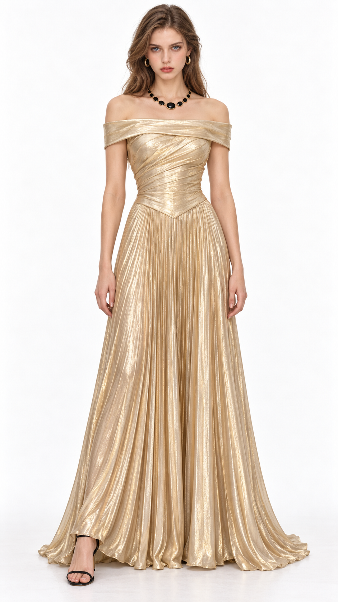
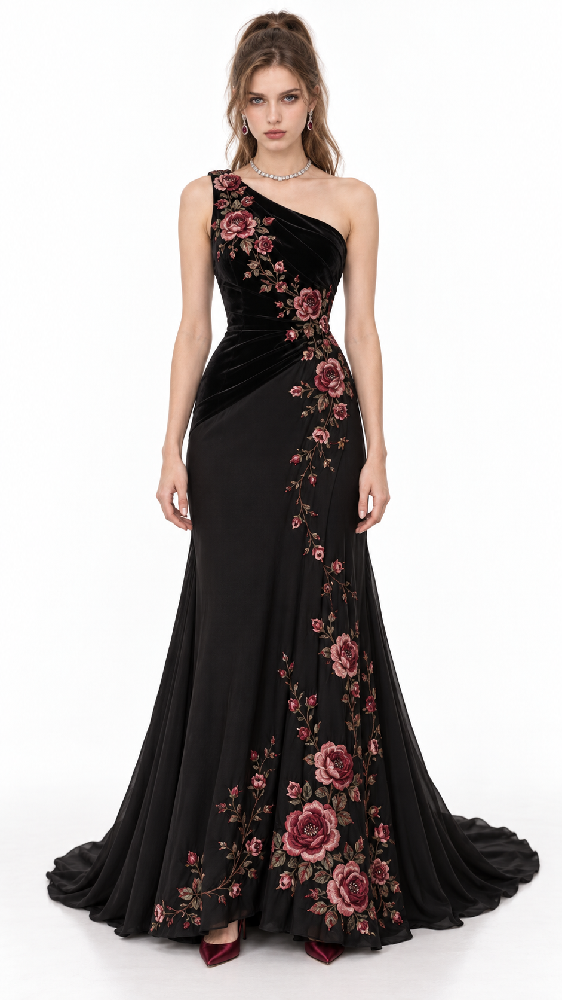

# 复仇晚会｜第三轮成图反馈与有效改动

本轮用户提供两张实际成图，评价两套约 78 分，金色可到 80 分，肯定质感提升。按 **金色 80 分、玫瑰约 78 分**记录。源提示词见[第三轮交付](女主第三轮_金色与玫瑰_9比16提示词.md)。

## 金色：70 → 80 分

- 宽折领和上身斜褶、腰前向下的尖形接缝、下身细长褶纹形成清楚的方向变化。相同金色织物通过不同的褶纹组织，获得结构层次。
- 金属光泽沿褶峰与褶谷变化，有明暗和布料重量；面料的高级质感继续成立。
- 黑玛瑙金边项链与黑色细带鞋呼应，项链的渐变尺寸和领口间距适合肩颈留白。深色焦点丰富了金色，也避免首饰孤立出现。
- 源词所写的轻微不对称折领在图中不明显，不能将其当成已验证的得分原因；有效的是实际可见的褶纹、腰线与搭配关系。

## 玫瑰：60 → 约 78 分

- 花纹由较均匀的大花重复，改成沿肩部、腰侧和裙长延续的枝条，并在下摆增加花群。疏密、大小与方向有变化，大片黑色将图案衬出。
- 单肩斜线、腰侧褶皱与花枝方向相互支持；裙线从胯部较窄到下摆展开，整体比前轮宽 A 字花裙更修长。
- 花瓣边缘、丝线纹理与部分花心可读，表面有起伏；丝绒上身、较柔和的裙面与刺绣光泽有所区别。贴图感减弱，但单张成图不能证明所有缝制细节或多角度连续性。
- 白色短项链停在领口上方，玫色耳饰和酒红鞋联系花色，首饰与图案都有作用。无需把黑金粗链或整套宝石视作固定答案。

## 本次可保留的经验与边界

1. 用户认可的色材方向可以保持；通过领口、腰身、裙线与图案组织完成实质重设计，减少方向反复漂移。
2. 工艺描述落实到位置、厚度、线迹、受力、遮挡与受光，更容易检查模型是否实现；“高级面料”或只换工艺名称不够。
3. 首饰尺度、形状和位置同衣服及鞋履一起判断。是否需要项链按整套关系决定，不以数量达标。
4. 实图里有效的部分与源词里未实现的部分分别记录。本轮同时改变了多项变量，也有生成差异，评分上升不能归因于某一个提示词；不把刺绣、尖腰线、细褶或黑玛瑙写成通用配方。

当前证据支持本次礼服有进步：金色 80 分、玫瑰约 78 分。未证明稳定达到 85 分以上、同场压过所有嘉宾，或三视图与动作下完全连续；这些后续按实际制作需要验证。用户本轮只要求小结，不新增服装或通用执行规则。
