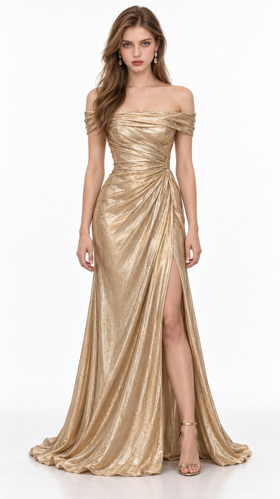
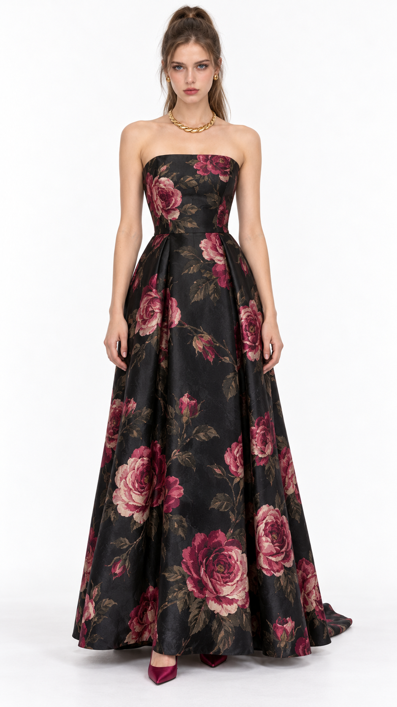

# 复仇晚会｜第二轮成图反馈与复盘

日期：2026-09-30。两套均为女主同场备选。用户本轮要求反思原因，没有要求立即交付新服装或出图。

## 评分与证据

| 方案 | 用户评分与要点 | 实图观察 | 源提示词核验与定位 |
| --- | --- | --- | --- |
| 香槟金 | **70 分**；高级，配饰少，其他设计不足，没有眼前一亮 | 金色织物光泽、落肩领口、腰侧聚褶和长裙均可读；仅有耳饰，肩颈空置；整体是较熟悉的落肩褶皱礼服 | 源词主动写了 `Her collarbones remain unadorned`，不是生成漏项链。主要失败在款式与整套选择，不能以金色材料的高级质感抵扣女主压场的任务 |
| 黑底玫瑰花纹 | **60 分**；有 PS 贴图感，花纹假，建议下次加刺绣描述 | 抹胸、自然腰线与大褶 A 字裙成立；大花延续上下身，画面有细织纹，但工艺起伏不明显；金链、花纹与传统裙型没有形成鲜明的当代女主形象 | 源词写 `silk-jacquard` 和 `woven throughout`，没有指定刺绣。材质表达仍可改善，但换工艺词不能保证改变整体款式的吸引力 |

额外执行偏差：金色源词要求开口从膝部开始，实际开口高于膝部。这不作为用户本轮评分原因，但后续需要更明确的闭合结构与开口落点。

## 为什么学习和规则未转成效果

1. **选款熟悉，表面变化承担了过多任务。** 两套的差异主要是金色光泽与花纹、窄长裙与 A 字裙；各自内部仍沿用常规礼服组合。材料确有价值，但本次没有充分支撑“华丽嘉宾中更突出”的角色要求。
2. **对上一轮批评修正过度。** 首轮的外裙、珠绣和宝石套饰竞争失败后，金色方案直接让肩颈空置，退向稳妥整体。需要修正的是首饰与衣服的关系，不是减少首饰本身。协调改善不能冒充设计突破。
3. **候选选择标准没有真正执行到位。** 源文档曾写“两套均满足本轮强设计目标”，实际评分否定该预判。文字里“流动”“花纹气场”等说明不能当视觉完成度证据；自然、覆盖和画幅过关，也不能替代吸引力检查。
4. **此前 80 分方案的有效关系没有成功转译到本场。** 之前暖色纹样与首饰呼应、甜软蕾丝与硬工装的反差来自完整搭配；本轮不能靠一体礼服换一种表面就假定同样有效。这是本批测试的推断，不是关于所有礼服的普遍结论。
5. **短剧同场层级仍未证明。** “复仇”没有对应到清楚的自我呈现选择；“女主更华丽”也只在说明中出现。白底单人图可检查衣物，却尚未验证角色置于华丽嘉宾中时的吸引力。本轮不擅自补写复仇对象或经历。

## 后续针对本场的修正方向

- 保留金色成图已成立的光泽与布料曲线；下一次需要实质发展领口、身体与裙的比例、首饰组织或材料关系，不能只加项链、提高光泽或换颜色就说已经升级。
- 花纹若改刺绣，具体描述线迹方向、花瓣边缘厚度、入布固定、起伏和微小阴影，且在褶皱处跟随弯曲、遮挡与受光；先决定花纹的放置与疏密。提花、印花和刺绣是不同工艺，不能混写为同一层，也不永久禁用提花或印花。
- 设计选择时给出能检查的可见差异与淘汰依据。熟悉款式本身可以优秀，但本场额外要求女主吸引华丽嘉宾；下一稿需说明这种优势具体由什么可见关系承担，不能仅使用“高级、流动、华丽”等评价。
- 相同脸模、场合和资产站姿继续保持。参考与限制用来支撑设计，不继续堆通用禁令；不将饰品数量、花纹、露肤或异形轮廓变成新的达标配额。
- 可选向用户索取一张本场 85 分以上目标造型，用于校准审美强度。没有参考也继续自主构思，不把设计任务交给用户。

## 状态

两套提示词已完成；用户已提供实际成图；金色 70 分、花纹 60 分；均未锁定正式资产，未达 85 分目标。本轮只归档评分与反思，不新增第三轮提示词，不改通用执行规则。

后续：用户要求保持金色与玫瑰两种风格继续修饰和重设计，已交付[第三轮两套提示词](女主第三轮_金色与玫瑰_9比16提示词.md)。用户已提供实际成图并给出金色 80 分、玫瑰约 78 分，见[第三轮反馈](第三轮成图反馈与有效改动.md)；第二轮源词与反馈保留追溯。
