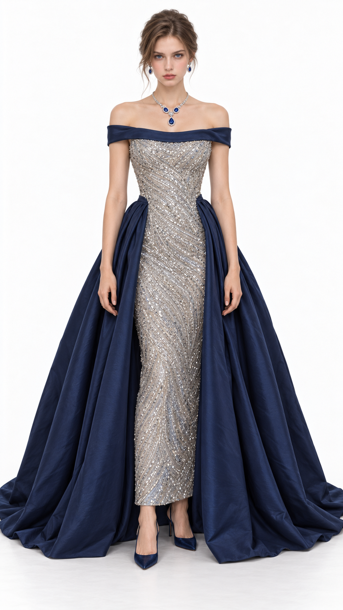
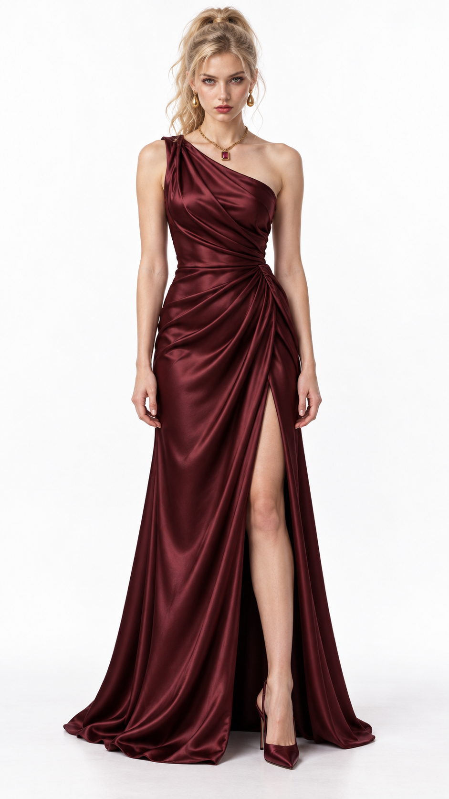

# 复仇晚会｜首轮成图反馈

日期：2026-09-30。仅记录本次独立服装测试，未提供完整剧本。

## 用户评分与实际证据

| 造型 | 用户反馈 | 实际可见关系 | 定位 |
| --- | --- | --- | --- |
| 女主 | **50 分**；太刻意、为了设计而设计，宝石项链突兀，整体设计不成立 | 午夜蓝领口折边、银色密集珠绣窄裙、两侧宽大蓝色外裙和成套蓝宝石均按源方案出现；银色中心与大块深蓝侧裙割裂，胸腰和全身的装饰关系缺少自然衔接 | 主要是**整体设计选择失败**；成图已实现核心要求，不能将失败归咎生成器或仅删项链 |
| 女二 | **70 分**；正常水平 | 黑樱桃单肩缎面从胸前到腰侧、裙身形成连续斜褶，金色首饰与裙色形成暖色联系 | 方向有正常完成度，尚未达到本项目高分目标；本轮不要求重设计女二 |

附带资产观察：女主裙摆两侧在画面底部接近或超出边界；女二开衩高于源词所写的膝部。这些属于执行与资产检查，不能冒充用户给低分的原因。

## 改版范围

- 用户本轮要求：重新设计**两套女主礼服备选**；均用于同一都市复仇晚会，保持比华丽嘉宾和女二更强的吸引力。
- 沿用女主原始身份图 `测试02.png`、9:16 正面全身白底、空手自然站姿与不露沟要求。失败成图仅作反馈证据，不自动成为生成参考。
- 重做整体，分别测试金色织物的连续垂褶与黑底大花纹的长裙轮廓。两套改变材料、体量、图案、首饰与妆发关系，避免仅换颜色。
- 大裙量、珠绣和宝石本身没有被永久禁用；本次失败不构成全项目禁令。检查的是这些元素是否支持同一套形象。
- 首轮“女主压过女二”的判断未经验证且被反馈否定；第二轮同样只记设计预判，等待实际成图与评分。

## 参考使用边界

本轮复看了项目内已认可的[黑丝绒与电蓝礼服](../2026-09-25_纽约服装概念验证/成图/02_晚会礼服_黑丝绒电蓝.png)、[巧克力针织与豹纹组合](../2026-09-25_自主两套服装验证/成图/01_巧克力针织豹纹裙.png)，以及用户本轮两张实图。前者用于比较真实体量与材料衔接，后者用于比较图案、领口留白和首饰之间的关系，不复刻整套单品。

外部商品页的浏览器查看因自动审批额度限制未执行，未将搜索摘要算作实图研究证据。

## 状态

首轮：提示词已完成；用户已提供实际成图；女主不认可，女二为正常水平；均未锁定正式资产。

第二轮：见[女主两套提示词](女主第二轮_9比16试装提示词.md)；用户已提供实际成图，金色 70 分、花纹 60 分。详见[第二轮复盘](第二轮成图反馈与复盘.md)。
